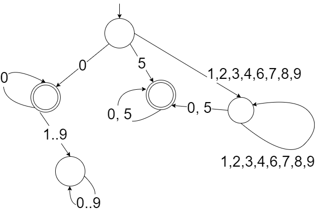

# Домашнее задание по ФЯ
## Задание 1

## Задание 2

## Задание 3
Мой любимый язык программирования - питон, второй - C++. До недавнего времени я весь код писал на 
17-ом стандарте, поэтому сейчас самое время посмотреть на новые фичи из 20-ого стандарта. \
Документацию я решил искать на [cppreference](https://en.cppreference.com/w/cpp/20)
### Designated Initializers
К 20-ому стандарту наконец-то из языка Си в урезанной форме принесли "листы инициализации". 
Теперь различные структурки данных struct, union, class. Можно сразу инициализировать следующим образом:

```cpp
struct A { 
    int x, y; 
};
struct B { 
    struct A a; 
};

A a = {.x = 1, .y = 2};
union u { int a; const char* b; };
u f = { .b = "asdf" }; 
```
Тем не менее некоторые вещи законные в Си все еще не доступны в C++. Что заставляет меня немного грустить. 
```c
struct A a = {.y = 1, .x = 2};
int arr[3] = {[1] = 5};        
struct B b = {.a.x = 0};       
struct A a = {.x = 1, 2}; 
```
### `Operator<=>`
Новенький оператор '<=>' принимает два сравнимых объекта и возвращает специфический объект, сравнимый с 0. 
Пример использования: 
```cpp
int main()
{
    double foo = -0.0;
    double bar = 0.0;
 
    auto res = foo <=> bar;
 
    if (res < 0)
        std::cout << "-0 is less than 0";
    else if (res > 0)
        std::cout << "-0 is greater than 0";
    else // (res == 0)
        std::cout << "-0 and 0 are equal";
}
```
### `Operator==() = default`
Теперь в плюсах в различных структурах данных можно задать 'operator==' по умолчанию, 
компилятор догадается как его определить, полезно для контестиков всяких.
```cpp
struct node {
    int x, y;
    bool operator==(const node &a) const = default;
};

int main() {
    node a = {1, 1}, b = {1, 1};
    if (a == b) {
        std::cout << "a and b are equal" << std::endl;
    } else {
        std::cout << "a is different from b" << std::endl;
    }
    return 0;
}
```
## Задание 4
Язык для описания конечных автоматов.  
Все состояния описаны переменными трех типов. Переменные первого типа 'cond' для вершин содержащие информацию,
 к какому классу они принадлежат: `terminate, start, stock, regular`.  
 Переменные второго типа `alph` описывают алфавит через фигурные скобочки.  
 Переменные третьего типа `edge` описывают переход и задаются тройкой `(cond from, cond to, alph a)`
 ### Пример 1
Дается на вход бинарная строка, автомат принимает строку если количество единиц четно. 
```
cond q1 = start
cond q2 = regular
cond q3 = terminate
alph a1 = {1}
alph a2 = {0}
edge e1 = (q1, q2, a1)
edge e2 = (q2, q2, a2)
edge e3 = (q2, q3, {1}) // Язык крутой, он поддерживает  
                        // неявные преобразования и комментарии 
edge e4 = (q3, q3, {0})
edge e5 = (q1, q3, {0})
```
### Пример 2
Введем два новых оператора `&` и `\` работающие с алфавитами. Первый берет на вход два алфавита и возвращает объедененый алфавит, другой берет либо два либо один параметр, в возвращает разность `A\B` двух алфавитов. Во втором случае берет разность от любого алфавита, то есть по факту в этот алфавит входят любые символы кроме тех, что мы вычли.  
Теперь опишем автомат принимающий только строки со строчными буквами `а, b, c`.  
```
cond q1 = start
cond q2 = stock
cond q3 = terminate
alph a = {a, b, c}
edge e1 = (q1, q3, a)
edge e2 = (q1, q2, / a)
edge e3 = (q3, q2, / a)
edge e4 = (q3, q3, a)
edge e4 = (q2, q2, / {})    // {} --- пустой алфавит
```
### Пример 3 
Алфавит принимает бинарные строки и не любит все другие
```
cond q1 = start
cond q2 = stock
cond q3 = terminate
edge e1 = (q1, q3, {1, 0})
edge e2 = (q1, q2, / {1, 0})
edge e3 = (q3, q2, / {1, 0})
edge e4 = (q3, q3, {1, 0})
edge e4 = (q2, q2, / {})
```
## Задание 5
Чтобы подсветить свой код я решил использовать extension для VSCode. Благо шаблон уже лежал в репозитории. Первым делом я изменил  файле [package.json](vscode_ext/package.json) расширение на `.automat`, чтобы VSCode распознавал соответствующие файлы. После этого я ашел в файл [mk.tmGrammar.json](vscode_ext/syntaxes/mk.tmGrammar.json) и начал прописывать паттерны для слов в моем языке. Разделил их на четыре группы: `type`, `status`, `comment` и `operators`. Соответственно,написал для них непересекающиеся регулярки. Проверил что работает для файлов с расширением `.automat`. 

[Сам extension](vscode_ext)